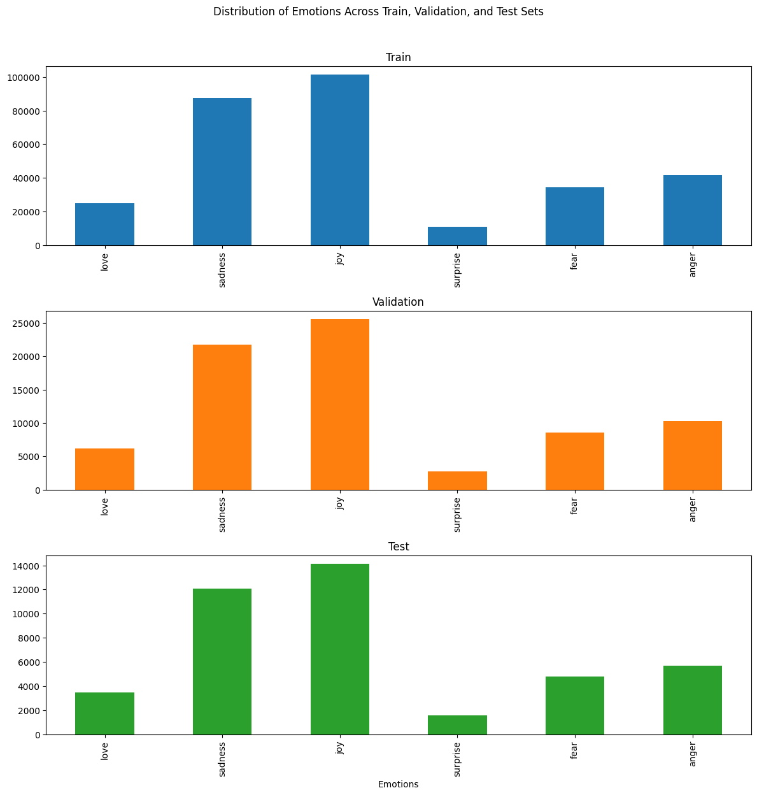
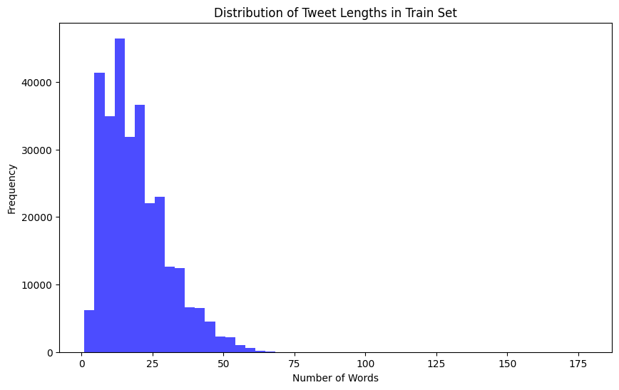
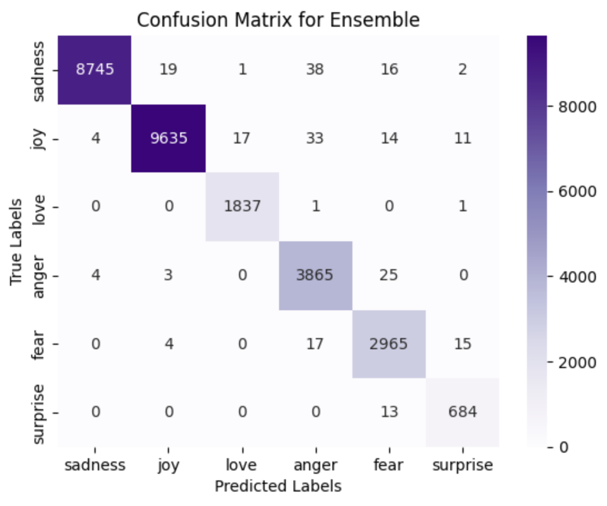

# tweet-emotion-classifier
This project explores deep learning methods for classifying emotions in tweets into six categories: anger, fear, joy, love, sadness, surprise.
It compares several recurrent neural network architectures (RNN, LSTM, GRU, and their bidirectional variants) and applies extensive preprocessing and cleaning to improve classification accuracy.

## Dataset

The project uses the [dair-ai/emotion](https://huggingface.co/datasets/dair-ai/emotion) dataset from Hugging Face.  
It contains ~400,000 English tweets labeled with 6 emotions: `anger`, `fear`, `joy`, `love`, `sadness`, and `surprise`.

- **Train/Test split**:  
  - 90% training  
  - 10% test  

- **Validation split** (from the training set):  
  - 80% training  
  - 20% validation  

**Final distribution:**  
- ~300,102 training samples  
- ~75,026 validation samples  
- ~41,681 test samples  

Can obv. be changed as one see fit.

## Project Pipeline

### 1. Exploratory Data Analysis (EDA)
- Counted number of classes in train, validation, and test sets  
- Visualized class distributions  
- Analyzed tweet length distributions  
- Checked for duplicates and resolved them by assigning the most frequent label  
- Ensured no overlap across splits  

Tweet emotion distribution and tweet length in training set (more in code)

### 2. Preprocessing & Tokenization
- Built vocabulary  
- Tokenized tweets and padded sequences  
- Checked vocabulary coverage (unique tokens, frequency distribution, 95% coverage)  

### 3. Initial Modeling
Implemented multiple models:
- Standard RNN  
- Standard GRU  
- Standard LSTM  
- Bidirectional RNN  
- Bidirectional GRU  
- Bidirectional LSTM  

**Training setup**:  
- Early stopping  
- Class weights for imbalanced classes  
- Evaluation with accuracy, confusion matrix, and classification report  

---

## Data Cleaning & Refinement

After the first training round, data was cleaned to improve performance:
- Converted all text to lowercase  
- Removed or normalized URLs, mentions, and hashtags  
- Checked and corrected common misspellings (including contractions)  
- Removed very short tweets  
- Truncated overly long tweets  
- Rebuilt vocabulary after cleaning  

### Retraining
Only **Bidirectional GRU** and **Bidirectional LSTM** were retrained, as they had shown the best performance.  

---

## Results

- Models evaluated on test set using:
  - Accuracy scores  
  - Classification reports  
  - Confusion matrices  

- **Ensembling** of best models was performed to improve robustness and final performance.  

Confusion matrix fro ensemble model:

